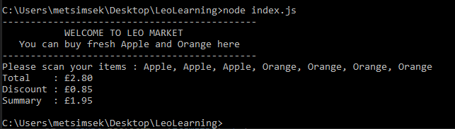

# LeoLearning
Pre-interview Exercise for Developer Candidates

Node must be installed on your computer to run the app

1. Open Command Prompt

2. Navigate to the folder containing index.js 

3. Simply run "node index.js"

4. Application should run

